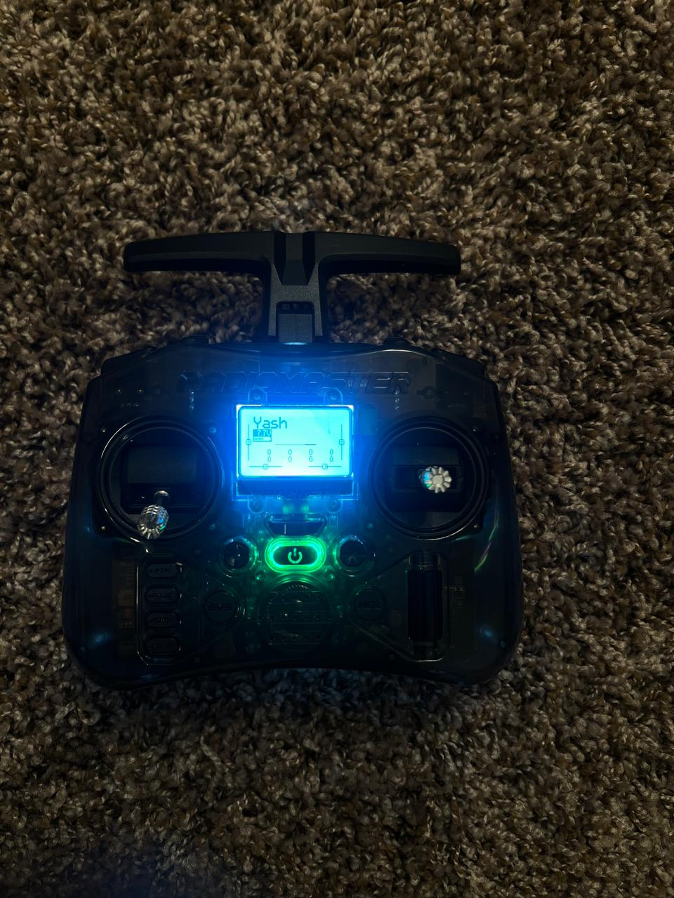
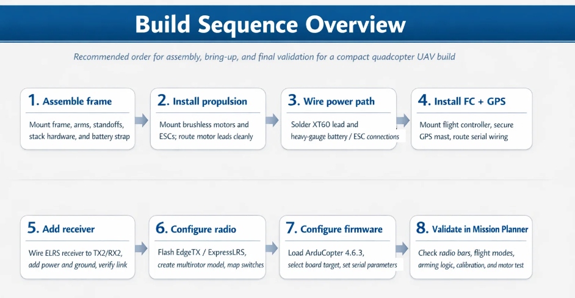
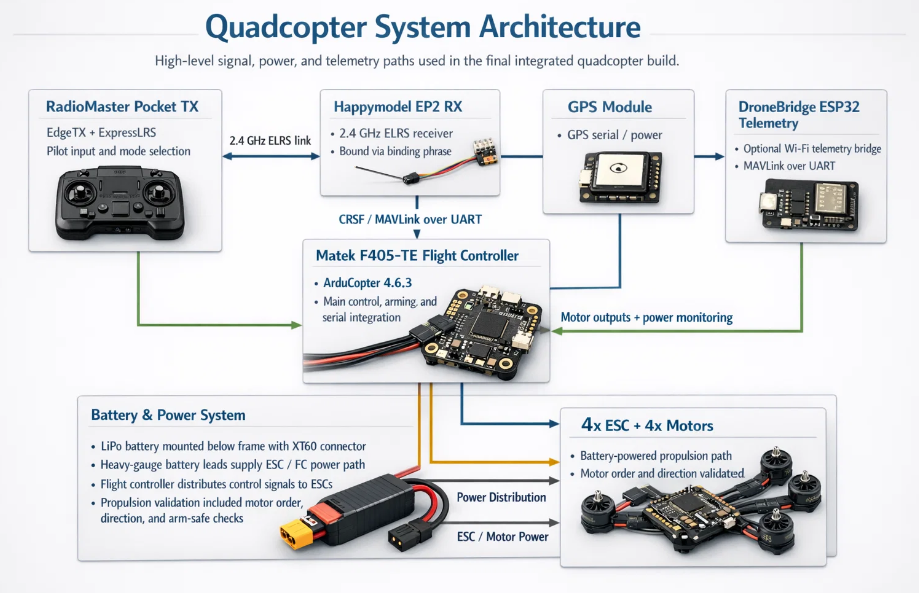

# Quadcopter UAV Build and Integration

**Author:** Yash Daniel Ingle  
**Role:** Embedded Systems Engineer  
**Institution:** University of California, Irvine  
**Program:** Master of Embedded and Cyber-Physical Systems  
**Project Category:** UAV System Build, Integration, and Validation  
**Location:** Irvine, California, USA

Graduate-level quadcopter UAV build and integration project covering mechanical assembly, electrical wiring, ArduCopter flight-controller setup, ESC and brushless motor bring-up, ExpressLRS radio configuration, GPS integration, optional ESP32-based Wi-Fi telemetry, and final parameter tuning for stable and validated multirotor operation.

---

## Project At-a-Glance

**Focus areas:** embedded hardware integration, UAV bring-up, wiring and power-path integration, ArduCopter configuration, radio/receiver setup, Mission Planner validation, telemetry integration, and final configuration preservation.

**Key technologies:** ArduCopter, Mission Planner, ExpressLRS, EdgeTX, BLHeli_S, DroneBridge ESP32, UART-based subsystem integration.

**Repository highlights:**
- End-to-end UAV build and integration workflow
- Hardware/software bring-up and validation
- Wiring and system architecture documentation
- Reusable parameter configuration file
- Structured guides for reproducibility

---

## Certifications

- [FAA TRUST Completion Certificate](docs/certifications/faa_trust_certificate_redacted.pdf)  
  Recreational UAS Safety Test (TRUST), issued by the Academy of Model Aeronautics, October 2025.

## Overview

This repository documents my end-to-end build, integration, configuration, and bring-up of a compact quadcopter UAV completed as part of a graduate drone systems project.

The work includes:
- mechanical assembly of the airframe
- electrical integration of battery, ESCs, and wiring
- flight-controller setup using ArduCopter
- radio control link setup using ExpressLRS
- GPS integration and system configuration
- Mission Planner validation and parameter tuning

This project reflects practical embedded systems work at the hardware-software boundary, including system integration, debugging, validation, and final configuration capture.

---

## For Recruiters and Hiring Teams

This project demonstrates hands-on experience in:

- embedded hardware bring-up
- flight-controller and firmware configuration
- electrical wiring and power-path integration
- UART-based receiver and telemetry integration
- radio setup and control-link validation
- GPS and navigation subsystem integration
- bench-level testing and validation workflows
- structured documentation and reproducible system setup

This is a real hardware build and validation project, not a simulation-only exercise.

---

## Key Skills Demonstrated

- Quadcopter assembly and system integration
- ESC and brushless motor bring-up
- Flight-controller configuration using ArduCopter
- ExpressLRS transmitter/receiver setup and binding
- UART wiring and serial interface integration
- GPS module integration
- Mission Planner validation and tuning
- Embedded system debugging and verification
- Documentation for reproducible builds

---

## System Images

### Drone Build


### Controller / Radio Setup




---

## System Architecture and Wiring

### Build Sequence Overview



### System Architecture



### ExpressLRS Receiver Wiring


### DroneBridge Telemetry Wiring


---

## Repository Structure

```text
quadcopter-uav_drone-build-integration/
├── README.md
├── ParameterFiles/
│   ├── README.md
│   └── paramsquadcopter_final.param
├── docs/
│   ├── diagrams/
│   │   ├── build_sequence_overview.png
│   │   ├── dronebridge_wiring.png
│   │   ├── elrs_receiver_wiring.png
│   │   └── system_architecture.png
│   ├── guides/
│   │   ├── 01_quadcopter_build_guide.pdf
│   │   ├── 02_wiring_and_interfaces_guide.pdf
│   │   ├── 03_radio_and_mission_planner_setup.pdf
│   │   └── 04_telemetry_and_final_configuration.pdf
│   └── images/
│       ├── Controller1.jpeg
│       ├── Controller2.jpeg
│       ├── Controller3.jpeg
│       ├── Controller4.jpeg
│       ├── Drone1.jpeg
│       ├── Drone2.jpeg
│       ├── Drone3.jpeg
│       ├── Drone4.jpeg
│       ├── Drone5.jpeg
│       ├── Drone6.jpeg
│       └── Video1.mp4
